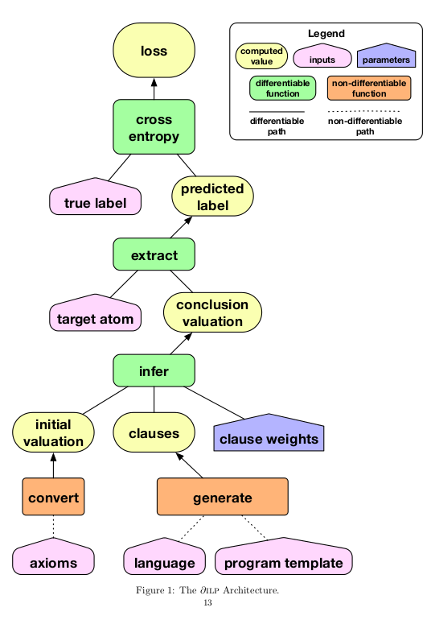

#Learning Explanatory Rules from Noisy Data

[paper](http://www.jair.org/media/5714/live-5714-10391-jair.pdf)

1. Intuitive Perceptual Thinking ~> Deep Learning
2. Conceptual, Rule-based Thinking ~> symbolic program synthesis 

> deep learning systems are robust to noisy data but difficult to interpret and require large training data.
> symbolic systems are easier to interpret and less training data but struggle with noisy data.

∂ILP  `(continuous representations of rules are learned through BP against likelihood objectivew)` searches through the space of programs using gradient descent. if the outputs of the program conflict with the desired outputs from the reference data, the system revises the program to better match the data.

**extensional predicates VS intensional predicates**
**Satisfiability Problem**

###### training loop

#### Contribution

**Differentiable Inductive Logic Programming (∂ILP)**
> a differentiable implementation of the satisfiability solving process

**central component**
> differentiable implementation of deduction through forward chaining on definite clauses.

**Task**
> reinterpret ILP task as a binary classification problem, and minimise cross-entropy loss with regard to ground-truth boolean labels during training.

> Instead of using Boolean flags to choose a discrete subset of clauses, we now use continuous weights to determine a probability distribution over clauses.

**Major limitation**
> it requires significant memory resources. 

> currently only support predicates of arity 0,1,2. Not support ternary predicates or higher

> insist that all clauses have exactly two atoms in the body

**4 restriction for generated clauses**
> 1. rule out clauses that are unsafe (a variable used in the head is not used in the body)
> 2. circular
> 3. duplicated
> 4. do not respect the intensional flag int 

---

##### Basic Definition

**clauses**
> α ← α1,...,αm
> 
> head ← body

**atom**
> α = tuple p(t1, ..., tn)
> 
> p = n-ary predicate
> 
> t1, ..., tn = items (variables | constants)

**ground**
> atom contains no variables

**A**
> set of atoms + ground + unground

**G (Herbrand base)**
> set of ground atoms

**γ**
> ground atom

**cnR(X)**
> immediate consequences of rules R applied to ground atoms X

> cnR(X)=X∪{γ|γ←γ1,...,γm ∈ground(R), γi ∈X}

> cnR(X)=X∪{α[θ]|α←α1,...,αm ∈R, αi[θ]∈X}

**R**
> a set of clauses

**R |= γ**
> R entails γ

> every model satisfying R also satisfies γ

---
**τ**
> A rule template, describes a range of clauses that can be generated
> 
> (v, int) , where 
> 
> 		• v ∈ N specifies the number of existentially quantified variables allowed in the clause
> 
> 		• int ∈ {0, 1} specifies whether the atoms in the body of the clause can use intensional
predicates (int = 1) or only extensional predicates (int = 0)

**Π**
> A program template, describes a range of programs that can be generated
> 
> (Pa, aritya, rules, T ) , where 
> 
> 		• Pa is a set of auxiliary (intensional) predicates; these are the additional invented predicates used to help define the target predicate
>
>		• aritya is a map Pa → N specifying the arity of each auxiliary predicate
>
> 		• rules（一对rule template：τ）is a map from each intensional predicate p to a pair of rule templates (τ_p1,τ_p2)
>
>		• T ∈ N specifies the max number of steps of forward chaining inference

---
##### ILP Problem
a tuple (B, P, N ) of ground atoms, where:
> • B is a set of background assumptions, a set of ground atoms.

> • P is a set of positive instances - examples taken from the extension of the target predicate to be learned

> • N is a set of negative instances - examples taken outside the extension of the target predicate

a **solution** is a set R of definite clauses such that:
>• B, R |= γ for all γ ∈ P

>• B, R   γ for all γ ∈ N

for instance:
> B = {zero(0), succ(0, 1), succ(1, 2), succ(2, 3), ...}
> 
> P = {even(0), even(2), even(4), even(6), ...}
> 
> N = {even(1), even(3), even(5), even(7), ...}
> 
> R:
> 	
>		even(X) ← zero(X)

>		even(X) ← even(Y ), succ2(Y, X)

>		succ2(X, Y ) ← succ(X, Z), succ(Z, Y )

**solution** metholody:
> bottom-up: examining features of examples, extract specific clauses, generalise from clauses.
> 
> top-down: generate-and-test; transform searching for clauses into satisfiability problem.

**Top-Down is utilized in this paper**

> generate-and-test approach, in which clauses are generated from a language template. We assign each generated clause a Boolean flag indicating whether it is on or off.
> 
> choose an assignment to the Boolean flags such that the turned-on clauses together with the background facts together entail the positive examples and do not entail the negative examples