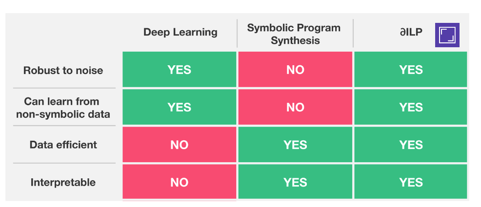
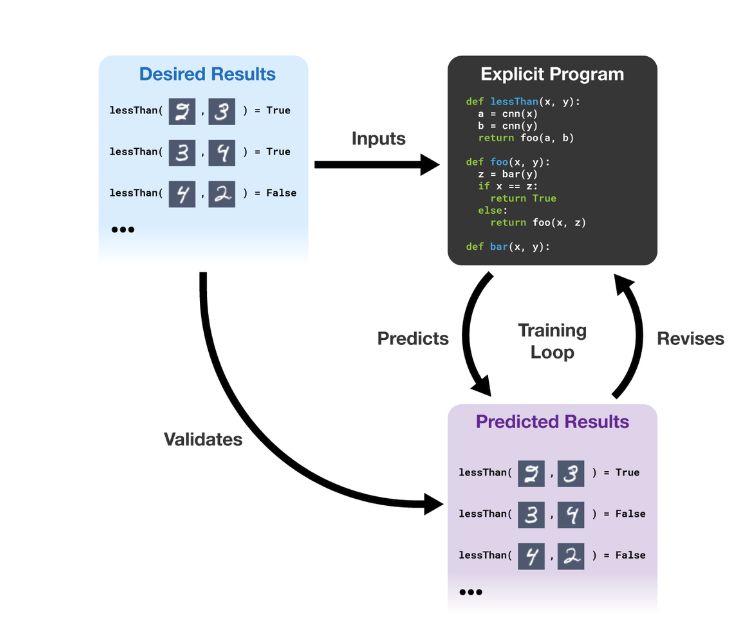

#Learning Explanatory Rules from Noisy Data

[paper](http://www.jair.org/media/5714/live-5714-10391-jair.pdf)

1. Intuitive Perceptual Thinking ~> Deep Learning
2. Conceptual, Rule-based Thinking ~> symbolic program synthesis 

> deep learning systems are robust to noisy data but difficult to interpret and require large training data.
> symbolic systems are easier to interpret and less training data but struggle with noisy data.

∂ILP searches through the space of programs using gradient descent. if the outputs of the program conflict with the desired outputs from the reference data, the system revises the program to better match the data.

###### training loop
