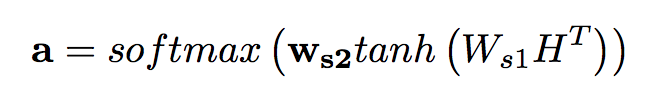
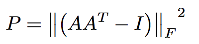

# A STRUCTURED SELF-ATTENTIVE SENTENCE EMBEDDING

encode variable sentence into a fixed size embedding, via bidirectional lstm with self-attention.

### attention mechanism: 

+ a, have multiple hops (rows), each hops focus one part of sentence.

**M = AH**, the embedded vector for setnence.

--
### penalization term

encourage hops' diversity: 

+ KL for any 2 hops. （unstable, multimodal）
+ 

Compared to the KL divergence penalization, this term consumes only one third of the computation

--

pruns weight connections by utilizing the 2-D structure of matrix sentence embedding.