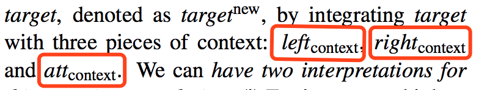
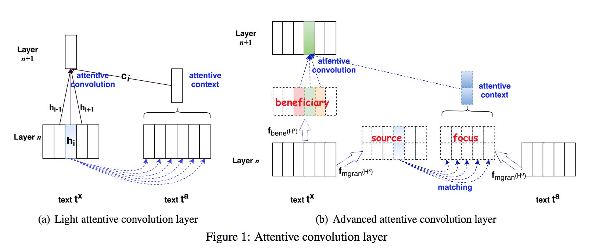
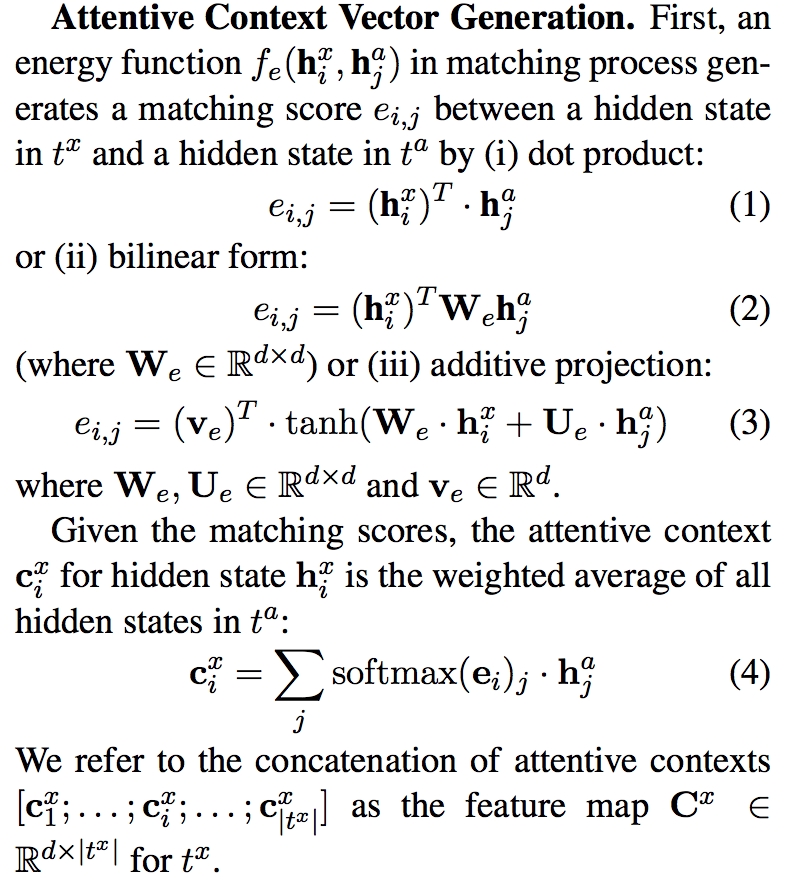

# Attentive Convolution

---

### 

对于n+1层的layer， 输入的数据为  **concat([h\_i-1, h\_i, h\_i+1, c\_i])**

c\_i 是：

+ attention的信息作为weight 作用于context的hidden state，视为加权求和。得到semantic representation  （这里因为是对所有的hidden state计算attention，因此照顾到了global info）
+ semantic representation作为补充信息，提供给模型。原始的hidden state信息依然照常计算