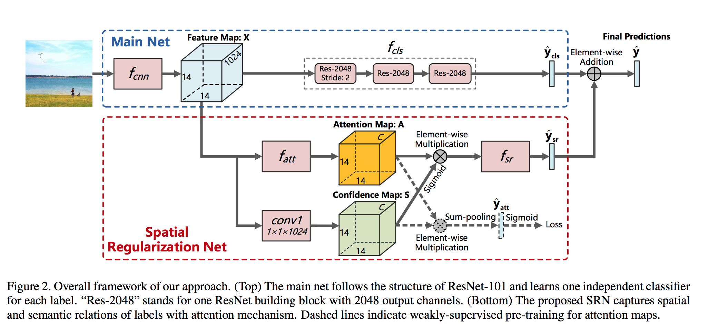
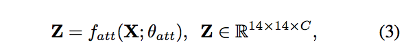
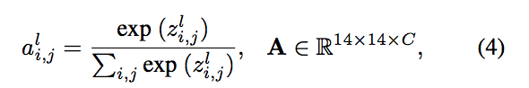
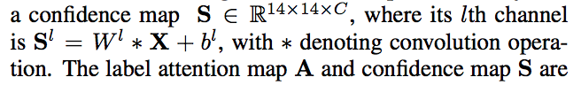
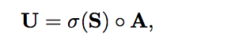
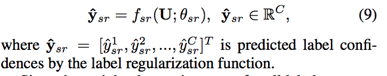
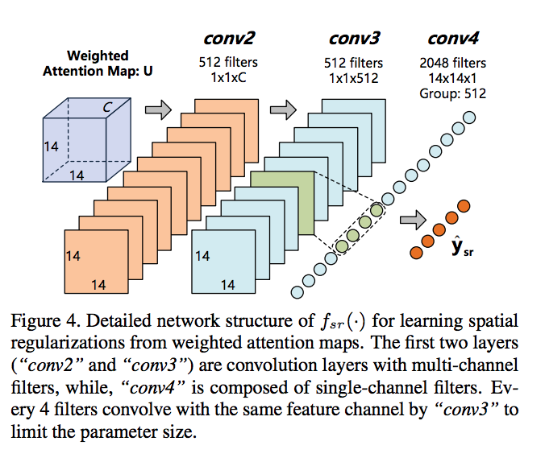
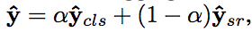

# Learning Spatial Regularization with Image-level Supervisions for Multi-label Image Classification

[**github**](https://github.com/
zhufengx/SRN_multilabel.)

### Feature Map

+ origin image (224\*224), processed by f_cnn(convolution), produced **Feature Map: X** (14\*14\*1024)

### Attention Map

卷积与normalization，形成attention

+ Feature Map, processed by f\_att() and got **Z** (14\*14\*C, C=n\_label), then normalze for each channel C, produced **Attention Map: A** (14\*14\*C). (In this experiment, f_att() is consist of [1\*1\*512] and [3\*3\*512], [1\*1\*C], three convolution)

### Confidence Map
+ Feature Map, processed by convlution, produced **Confidence Maps: S** (14\*14\*C)

	

### Spatial Regularization

没有见到attention map的连续性或者簇的惩罚项

+ Attention and Confidence Map, element-wise multiplication, produced **Weighted Attention Map: U**

	
+ label confidence by sr

	

	+ for f\_sr, first 2 layers are :
		+ semantic relation learning,
	+ for f\_sr, third layr is:
		+ spatial relation learning.

### Final prediction

+ final prediction is weighted classification\_prediction + weighted\_y\_sr

	