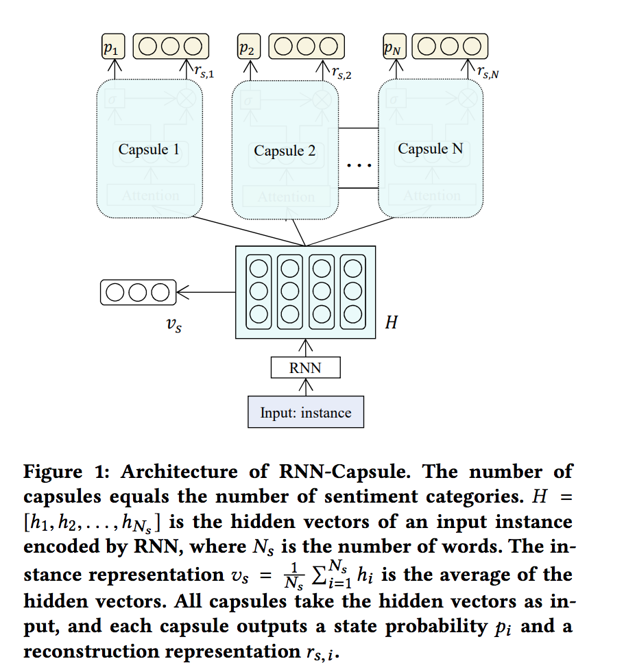

#Sentiment Analysis by Capsules
#### Recurrent Capsule
[paper](Sentiment_Analysis_by_Capsules/WWW18-Sentiment.pdf)

Based on capsule representation,the probability module computes the capsule's state probability.
(<mark>**winner take all**</mark>)
> capsule's state is active if its state probability is the largest among all capsules for the given instance, and inactive otherwise.

Structure
> attribute
> 
> state
> 
> modules: representatoin
> 
> modules: probability 
> 
> modules: reconstruction

#####representation module
uses attention mechanism to build the capsule representation

#####probability module
uses the capsule representation to predict the vacpsule's state probability

#####reconstruction module
rebuild the representation of the input instance.

#### Train

instance_representation = average of all the words' vector (OR average of all the hidden vectors)

Target:
> maximize the state probability of the capsule corresponding to the ground truth label, and minimize the rest.
> 
> minimize the distance between the reconstruction representation of the capsule selected by groud truth and the instance representation, maximize other pairs.

#### Architecture

--
