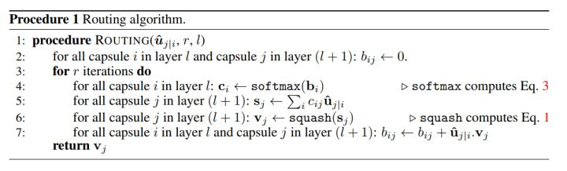
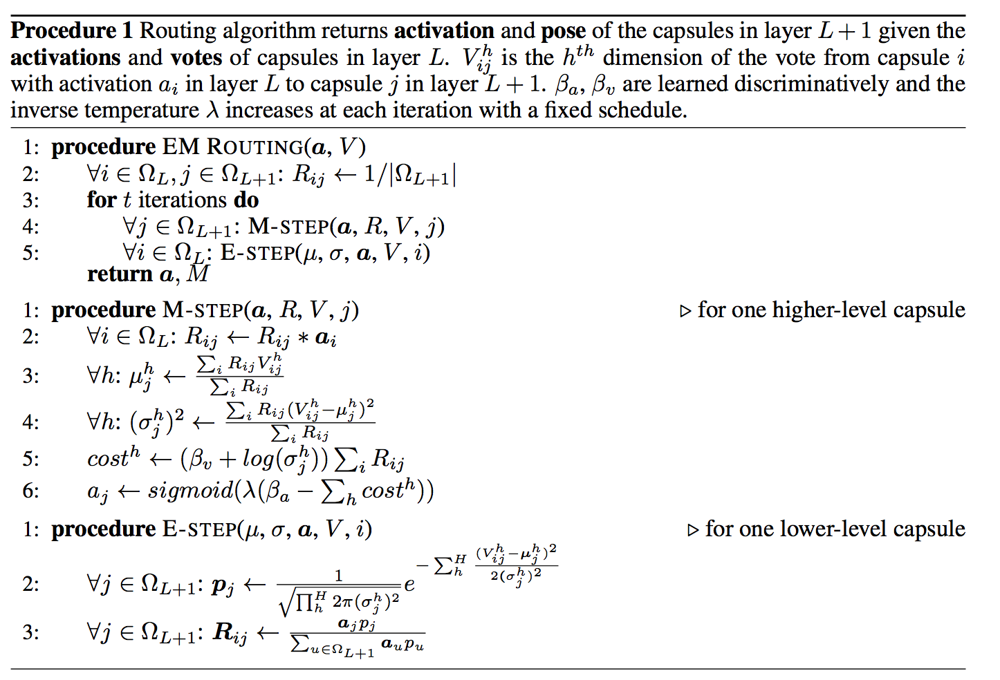

# Capsule 
> the 1st paper 

```
Author: Hinton
Abstract:
		Compared with CNN, which aims to improve classification accuracy, Capsule wants to represent knowledges (features) in different way which could contain more infomation about knowledges.
		In comapred with CNN or other structure, who represent features' existence by a seperate logistic unit (outputing probability), Capsules use the overall length of vector of instantiation parameters to represent the existence of the entity and to force the orientation of the vector to represent the properties of the entity(knowledge)
```
#### Characters:

<mark>separating and identifying overlapping</mark> handwritten digits with accuracy far beyond existing neural netowrks.	
	
details about CNN's shortage:
	[What is wrong with convolutional neural nets ?](https://www.youtube.com/watch?v=rTawFwUvnLE)

--

origin paper:
[Dynamic Routing Between Capsules]([nips2017]1710.09829v1_Dynamic Routing between Capsules.pdf)

--

good illustration:

[Understanding Hinton’s Capsule Networks(I)](Understanding Hinton’s Capsule Networks(I).pdf)

[Understanding Hinton’s Capsule Networks(II)](Understanding Hinton’s Capsule Networks(II).pdf)

---
mostly reference from: [zhihu](https://zhuanlan.zhihu.com/p/30970675?utm_source=wechat_session&utm_medium=social)

Equivariance:
> 位置编码(place-coded):视觉中的内容的位置发生了较大变化，则会由不同的Capsule表示其内容。
> 
> 速率编码(rate-coded):视觉中的内容为位置发生了较小的变化，则会由相同的 Capsule 表示其内容，但是内容有所改变。


#### Algorithm Details:

> Capsule高维向量，模长为概率，向量本身为属性(如：颜色、纹理、方向等)。

为了保证**模长为概率**，需要对capsule向量进行**squashing**操作，同时保证向量本身的方向不变：


> 其中 v_j 为输出向量，s_j为上一层capsule输出向量的加权和。

capsule的输入向量 **s_j** 计算过程分为2步：**线性组合** 和 **Routing**:

线性组合：


Routing:


> b_ij 依赖两个capsule的位置与类型，为常量。

--
**routing_algorithm:**



**Loss Function:**

marginal loss:

> L_k for each capsule. (in this equa above, k = c)
>
> where m_+ = 0.9
> 
> m_- = 0.1 
> 
> lambda = 0.5

--
**Reconstruction Loss:**

> 为防止重构损失主导了整体损失（从而体现不出Margin loss作用），作者还按 0.0005 的比例缩小重构损失。

---

Advance Thought:

[Hinton++ – Towards Data Science](Hinton++ – Towards Data Science.pdf)

```
Capsules are an attempt to overcoome geometric changes.
But it cannot solve such phenomenon:
	"It's a face, but the eyes are sideways, and the mouth is upside-down." because the eyes or the mouth are not lighting up, so the agreement cannot be realized. It does not have inference ("it should be, something, and which part is not as what I thought")
	Out brains seem to project the 'face expectation' back down to the lower layers, asking, 'if this were a normal face, what would the normal poses be for the moth, nose, and eyes?'
	The face's compression generates an expectation of pose for its parts!
```

---

# Capsule 
> the 2nd paper

## Matrix Capsules with EM routing
origin_paper:
[paper](MATRIX CAPSULES WITH EM ROUTING.pdf)

good illustration:

[illustration](https://jhui.github.io/2017/11/14/Matrix-Capsules-with-EM-routing-Capsule-Network/)
[zhihu](https://zhuanlan.zhihu.com/p/30970675?utm_source=wechat_session&utm_medium=social)

##### Abstract
> each capsule has a logistic unit to represent the presence of an entity and a 4x4 matrix which could learn to represent the rela- tionship between that entity and the viewer (the pose). 这一版capsule包含：4×4的姿势矩阵和1的激活值
> 
> A capsule in one layer votes for the pose matrix of many different capsules in the layer above by multiplying its own pose matrix by trainable viewpoint-invariant transformation matrices that could learn to represent part-whole relationships. L层的某Capsule_i通过将自身的Pose矩阵与视角不变矩阵的变换矩阵（viewpoint-invariant transformation matrix)相乘，从而为L+1层的许多不同Capsule的Pose矩阵进行投票。 
> 
> Each of these votes is weighted by an assignment coefficient. These coefficients are iteratively updated for each image using the Expectation-Maximization algorithm. 这些投票都会根据分配的系数加权。而这些系数进行EM算法迭代更新。


> A: convolution's channel
> 
> B: Primary Capsule numbers
> 
> 

**Algorithm**

> 对 i ∈ layer L, j ∈ layer L+1
> 
> 初始化投票加权系数R_ij =  1 / size(L+1)
> 

**Spread Loss**


> directly maximize the gap between the activation of the target class (at) and the activation of the other classes.
> 
> Spread loss is equivalent to squared Hinge loss with m = 1.

**Implementation Tricks**
> xavier initialization
> bias initialization with truncated normal initializer(0, 0.01)
> regularization, for instance: L1, L2.
