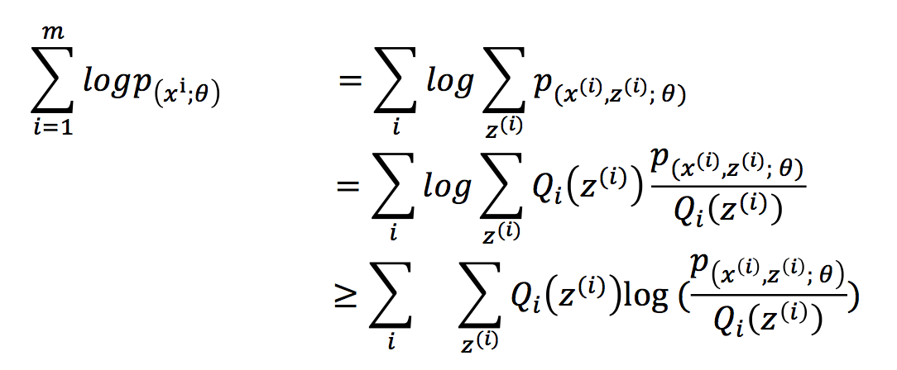

# EM Algorithm

#### 介绍
> EM算法通过引入隐含变量,使用MLE（极大似然估计）进行迭代求解参数。通常引入隐含变量后会有两个参数，EM算法首先会固定其中的第一个参数，然后使用MLE计算第二个变量值；接着通过固定第二个变量，再使用MLE估测第一个变量值，依次迭代，直至收敛到局部最优解。
> 
> 由于算法保证了每次迭代之后，似然函数都会增加，所以函数最终会收敛(最后有推到)。
>
> > initial guess of probability (parameters), => theta_A, theta_B
> 
> > E-step: calculate probability distritbution  （通过observed data和现有模型估计参数估计值 missing data，建立l(theta)的下界）
> 
> > M-step: compute new parameters （假设missing data已知的情况下，最大化似然函数，优化下界）

--
似然估计函数：
由于隐变量**z**的存在，很难直接对其进行求导计算。

> 其中Q 为z 的分布函数

--
对似然函数进行函数变换：

> 利用jensen不等式，由于log(x)的二阶导数为-1/x**2，为凹函数
> 
> 所以　f(E(x)) >= E(f(x))
> 
> 其中f为log()，x为 (p/Q) ;E(x)为 sum(p*x);

将上式改写，则为：
似然函数 **L(θ)>=J(z,Q)** 的形式（z为隐含变量），那么我们可以通过不断的最大化J的下界，来使得L(θ)不断提高，最终达到它的最大值。
> 固定θ， 调整Q(z)使下界J(z,Q)提升，使的在θ处，L(θ)=J(z,Q)
> 
> 固定Q(z)，调整θ，使下界J(z,Q)达到最大值。

---

#### Tutorial
[如何感性地理解EM算法？ - 简书](如何感性地理解EM算法？ - 简书.pdf)

[EM-最大期望算法](http://www.csuldw.com/2015/12/02/2015-12-02-EM-algorithms/)

---

#### Illustration
**[calculation explanation](https://math.stackexchange.com/questions/25111/how-does-expectation-maximization-work)**

