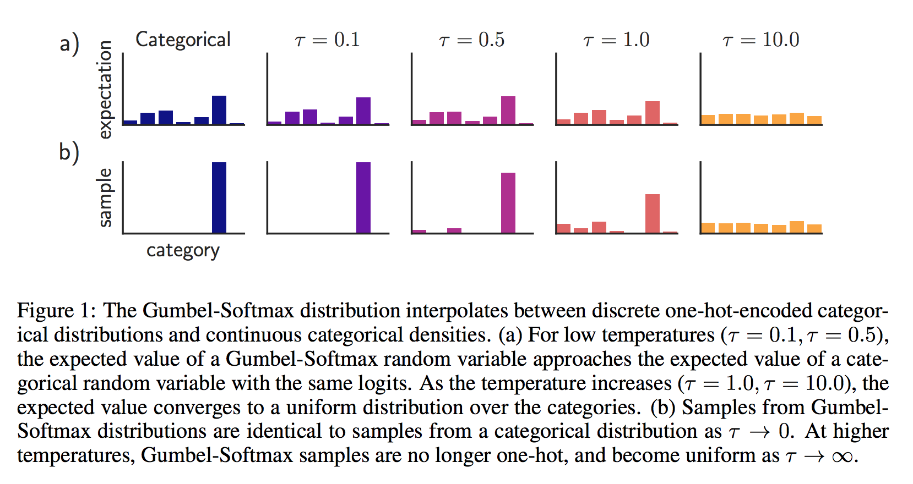
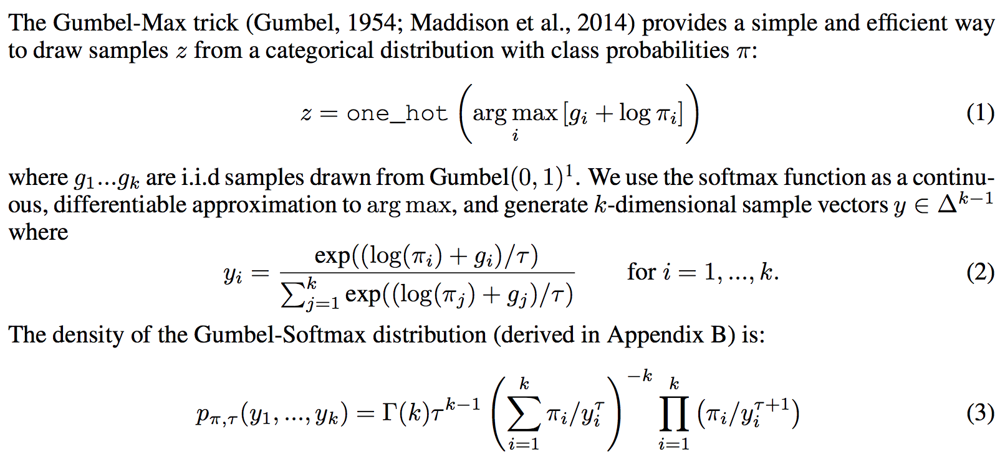

# CATEGORICAL REPARAMETERIZATION WITH GUMBEL-SOFTMAX

**[git_interpretation](https://casmls.github.io/general/2017/02/01/GumbelSoftmax.html)**

> replace **discrete Sampling procedure** into **continuous and differentiable sampling procedure** by *gumble softmax*

---

#### advantage
+ distribution is smooth for tau>0
+ has a well-defined gradient with respect to model parameter, thus can be uses in BP method

**Start from high temperature (tau), and anneal to a small but non-zero temperature.**

**If tau is a learned parameter(rather than annealed via a fixed schedule), it can be interpreted as entropy regularization**