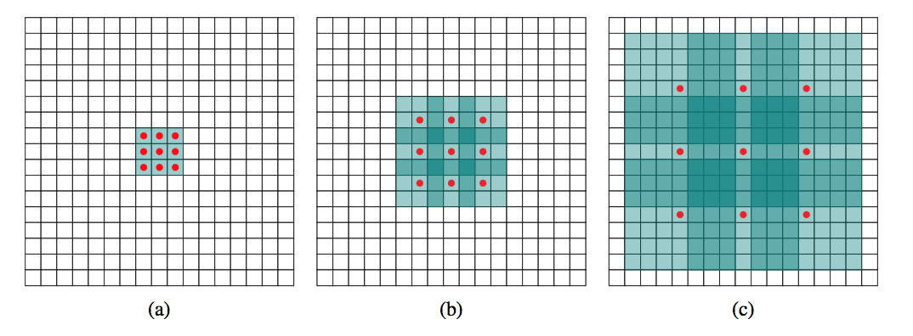

# Convolution Types

---
### Vanilla Convolution
kernel_size 
strip
padding

```python
# Example Pseudo code for vanilla convolution

import tensorflow as tf
from matplotlib import pyplot as plt
import numpy as np

tf.enable_eager_execution()
tf.executing_eagerly() # return True
img = plt.imread("")

# batch_size, weight, height, n_in_channel
lum = img[:,:,0].reshape(1,weight, height, 1).astype('float32')

# k_weight, k_height, n_in_channel, n_out_channel
kernel = np.eye(10).reshape((10,10,1,1)).astype('float32')

# padding: {'PADDING',"VALID"}
result = tf.nn.convolution(lum, filter=kernel, padding='VALID')

```

--
### Dilated Convolution \[[paper](https://arxiv.org/abs/1511.07122v3)\]

Expanding receptive field without loss of resolution or coverage.  
Reduce computational cost.  
```any task which needs upsampling after downsampling when using pooling. 
Like image segmentation```

<center>
逐层网络结构  
  

Layer1(a)kernel=3*3 | Layer2(b) kernel=3*3 | Layer3(c) kernel=3*3 |
--------------------|------------------|-----------------------|
dilation=1, receptive_field=3*3 | dilation=2, receptive_field=7*7 | dilation=4, receptive_filed=15*15 |
</center>

**Limitation**  
becase of keeping the details of data, the cost may be large compared with cost of using pooling.

**Case**  

+ WaveNet  

<mark>Image segmentation 的输出保持原始图像大小，这个的实现example写一个</mark>

--
### Separable Convolution


Used in Xception CNN.

**spatial separable convolution**
Get the same result, by multiplying with two smaller vectors instead of a vanilla convolution kernel.

**depthwise separable convolution**  
hypothesis that spatial and depthwise information can be decoupled

--
### Deformable Convolution

--
### Deconvolution  

a deconvolution is another convolution layer, that spaces out the pixels and performs an up sampling

--
### Design Criteria  
+ **extract saturate features**: they are generally stacked with an increasing number of filters in each layer(number of kernels). <u>*Each successive layer can have two to four times the number of filters in the previous layer*</u>. This helps the network learn hierarchical features.
+ **save computation cost**: decrease the size of the filters and increase the strides (like 1x1 convolutional filter)

### 1x1 Convolutional Filter

--
### Reference
[卷积方式大汇总](../../optimizer/CNN/CNN 中千奇百怪的卷积方式大汇总.md)