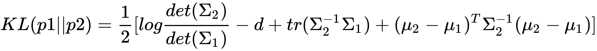
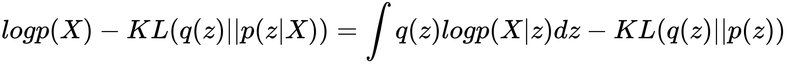

# KL vanish in autoregressive model

### Theoretical analysis

for variational inference, the target is maximize evidence lower bound (ELBO), which means *minimize reconstruction error and maximize the divergence between posterior distribution of latent variable distribution and prior latents' distribution*.

 

ELBO

--
### KL vanish straight view's explain

As seen in ELBO function, the target of the model is to maximize ELBO, which means minimize *KL(q(x)||p(z))* and maximize *integrate*(q(z)logP(x|z)).   

It is possible that, in seq2seq architecture model's decoder part, the decoder can predict the desire output without referring the latent code(which means the latent data is not used). In such situation, during the learning process, the task of minimizing KL divergence will be derived into making posterior distribution equal to prior distribution(usually unit gaussian distribution). 

The phenomenon described above can be saying as **KL vanish** or **posterior collapsing**

--
### How to contrary across it

The essential task is to make the decoder rely on the latent data **Z**.  

commonly used method are: 
 
**KL 思路**

+ (1) KL cost annealing.
	+ KL cost annealing 在使用上非常簡單，只需要在 KL 項上乘以一個權重係數，訓練剛開始的時候係數大小為0，給 q(z|x) 多一點時間學會把 x 的信息 encode 到 z 裡，再隨著訓練 step 的增加逐漸係數增大到 1。通常搭配 word drop-out（下面有介紹）一起使用效果最佳。
+ (2) Free Bits
	+ 让更多的feature encoded into latent variables，让KL的每一维里都“保留一点空间”： 如果这一维的KL值太小，则不去优化。*閾值 ε 要不斷嘗試，個人建議選取比如5左右的一個相對較小值*
+ (3) Normalizing Flow （autoregressive flow, inverse autoregressive flow）
	+ 先从一个简单分布采样latent variables, 然后通过不断迭代优化使得latent variables更加flexible （为了得到更好的posterior），难度较高。
+ (4) Auxiliary Autoencoder
	+ RNN与VAE各自的损失函数在训练初期会相互干扰，posterior学不好且（在建模conversation时）是否能够包含response需要的信息无法保证。因此显式地利用*z*对response的hidden层做autoencoder，并将VAE和AE两部分分开训练，保证更容易收敛。

**Reconstruction思路**
+ Word dropout
	+ 弱化decoder
+ CNN decoder
	+ dilated CNN decoder，通过调整CNN的宽度，能够无限逼近LSTM
+ Additional Loss
	+ 引入额外的loss，如：让*z*额外去预测哪些单词会出现(bag-of-words-loss)。 该方法可以看作是增大的reconstruction权重

--
### KL vanish study cases
+ 《Generating sentences from a continuous space》. CONLL 2016. || <mark>**KL cost annealing**</mark>
+ 《Improving variational inference with inverse autoregressive flow》. NIPS 2016. || <mark>**Free Bits**</mark>
+ 《Variational lossy autoencoder》. ICLR 2017. || <mark>**autoregressive flow, 不再局限gaussian的prior**</mark>
+ 《Improving Variational Encoder-Decoders in Dialogue Generation》. AAAI 2018. || <mark>**Auxiliary Autoencoder**</mark>
+ 《Z-Forcing: Training Stochastic Recurrent Networks》. NIPS 2017. || <mark>**Auxiliary Autoencoder**</mark>
+ 《Improved Variational Autoencoders for Text Modeling using Dilated Convolutions》. ICML 2017.|| <mark>**cnn decoder**</mark>
+ 《Learning discourse-level diversity for neural dialog models using conditional variational autoencoders》. ACL 2017. || <mark>**Additional Loss**</mark>
+ 《Data noising as smoothing inneural network language models》. ICLR 2017. || <mark>将**word dropout**证明位神经网络的平滑技术</mark>