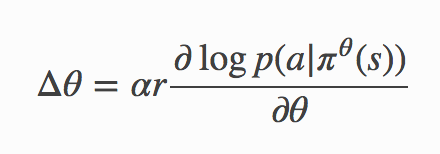
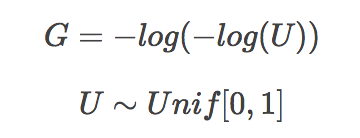

# backpropagate through random samples

---
### score function estimator**/**likelihood ratio estimator**/**REINFORCE

probability density functin is differentiable with respect to its parameters,  
使用REINFORCE方法计算loss：   

+ get action via sampling based on density， 
+ take action, get loss (log_probability for this action)
+ backpropagate 

  
> alpha: learning  rate  
> r: reward  
> theta: parameters   
> a: action

```python
## pytorch code
probs = policy_network(state)
# Note that this is equivalent to what used to be called multinomial
m = Categorical(probs)
action = m.sample()
next_state, reward = env.step(action)
loss = -m.log_prob(action) * reward
loss.backward()
```

log_prob: 

```  
    if is_binary:
        return torch.log(ps_clamped) - torch.log1p(-ps_clamped)
    return torch.log(ps_clamped)
```
--
### pathwise derivative estimator
common seen in reparameterization trick.  
can be utilized in VAE.    

parameterized random variable can be constructed via a parameterized deterministic function of a parameter-free random variable.

**Gumbel Softmax**  
most discrete nodes can be reimagined as samples from a distribution over discrete states.

Gumbel distribution  
  
for reparameterization with Gumbel (G\_i), and categorical probability(π\_i), reparametered categorical distribution is:  
<center><mark>dist = G\_i + π\_i</mark> </center> 

```python
#tensorflow code:
from tensorflow.contrib.distributions.python.ops import relaxed_onehot_categorical

dist = relaxed_onehot_categorical.RelaxedOneHotCategorical(temperature=10.0,probs=[0.75,0.25])

dist.sample()
```
[【reference】](https://uoguelph-mlrg.github.io/spaceNet_overview2/)

--
**Gaussian Variance**  

<center><mark>dist = Normal(0,1)\*theta + miu </mark></center>

```python
import tensorflow as tf

tfd = tf.contrib.distributions

loc= [0.1,0.2]
scale = [1,2]
dist = tfd.MultivariateNormalDiag(loc, scale)
loc = tf.zeros(2)
scale = tf.ones(2)
prior_dist = tfd.MultivariateNormalDiag(loc, scale)
code = posterior.sample()
```
[【Learning in latent variable models】](https://ermongroup.github.io/cs228-notes/learning/latent/)  
[【Variational Inference in TensorFlow】](https://danijar.com/materials/variational-inference-in-tensorflow.pdf)  
[【reference】](https://wiseodd.github.io/techblog/2016/12/10/variational-autoencoder/)  
[【知乎reference】](https://zhuanlan.zhihu.com/p/22464764)

--
