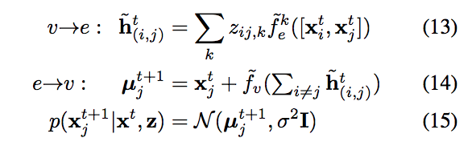

# Neural Relational Inference for Interacting Systems

有点神奇，和VAE的套路还不是完全一样，这里的latent variable更多的像是correlation factor。在decoder最后预测的时候进行了采样。然后采样结果进行常规的vae cost function进行BP计算。

### Model


一个Graph可分为：
+ Vertices, 以vertice embedding 的方式将每个结点转换为vector
+ Edges （分有多种types）， 将边所连接的vertices 通过非线性变换的encoder转换为edge vector

### Encoder


### Decoder  
```
zij为latent variable，  
```
