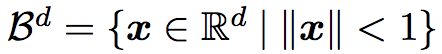
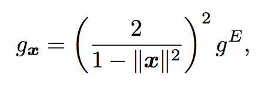
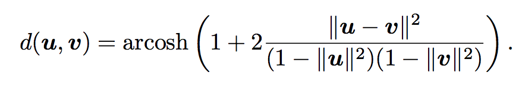

#### Poincaré Embeddings for Learning Hierarchical Representations

[paper](7213-poincare-embeddings-for-learning-hierarchical-representations.pdf)

[github](https://github.com/facebookresearch/poincare-embeddings)

Embedding methods suffer from a fundamental limitation:

	their ability to model complex patterns is inherently bounded by the dimensinoality of the embedding space.
	
<mark>hyperbolic space</mark>, whose distances are preserved approximately.

The approach on the Poincare ball model, as it is well-suited for gradient-based optimization. **Poincare ball has a Riemannian manifold structure.** Computing the embedding based on **Riemannian optimization**, which is easily parallelizable and scales to large datasets. 

##### Why Poincare ball?

1. First, in many datasets such as text corpora, multiple latent hierarchies can co-exist, which can not always be modeled in two dimensions.
2. a larger embedding dimension can decrease the difficulty for an optimization method to find a good embedding

**How inferring the hierarchical relationships fully unsupervised?**

Define:


Riemannian metric tensor:

```
where x and g^E denotes the Euclidean metric tensor
```
the distance between points u,v is given as 

```
this distance question is symmetric and that the hierarchical organization of the space is solely fdetermined by the distance of points to the origin.
```

Poincare ball changes smoothly with respect to the location of **u** and **v**. This locality property of the distance is key for finding continuous embedding of hierarchies.


##### Training Details

###### Initialization
1. initialize all embedding uniformally in U(-0.001, 0.001), which ensures closing to the origin of B^d
2. A good initial angular layout can be helpful to find good embeddings. Traing during an initial 'burn-in' phase with a reduced learning rate **nipslon/c**. c=10