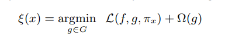

#### LIME
Local Interpretable Model-agnostic Explanation(2016kdd)

[intuition](./Introduction to Local Interpretable Model-Agnostic Explanations (LIME) - O'Reilly Media.pdf)

[paper](https://arxiv.org/abs/1602.04938v3)

[github](https://github.com/marcotcr/lime)

```
	Local fidelity
	Interpretable
	Model - Agnostic
	Explanations
```
We **generate an explanation by approximating the underlying model by an interpretable one** (such as a linear model with only a few non-zero coefficients), learned on perturbations of the original instance (e.g., removing words or hiding parts of the image). The key intuition behind LIME is that **it is much easier to approximate a black-box model by a simple model locally (in the neighborhood of the prediction we want to explain), as opposed to trying to approximate a model globally**. This is done by **weighting the perturbed images by their similarity to the instance we want to explain**. Going back to our example of a flu prediction, the three highlighted symptoms may be a faithful approximation of the black-box model for patients who look like the one being inspected, but they probably do not represent how the model behaves for all patients.

---
##### Contributions

1. LIME can explain the predictions of any classifier or regressor in a faithful way, by **approximating it locally with an interpretable model.**
2. SP-LIME selects a set of representative instances with explanations to address the **"trusting the model"** problem, via submodular optimization.
3. Comprehensive evaluation with simulated and human subjects, where we measure the impact of explanation on trust and associated tasks. 
---
##### Some challenge for model and evaluation can go wrong
```
Data Leakage
Data Shift
```
Machine learning practitioners often have to select a model from a number of alternatives, requiring them to access the relative trust between two or more models.

---
##### Interpretable Data Representation
Interpretable explanation need to use a representation that is understandable to human ,regardless of the actual features used by the model(number of features used can be too many)
```
Example of interpretable explanations:
	1. for text classification: a binary vector indicating the presence or absence of a word. even though the classifier may use more complex features such as word embeddings.
	
	2. for image classification: a binary vector indicating the presence or absence of a contiguous patch of similar pixels(a super-pixel), while the classifier may represent the image as a tensor with three color channels per pixel.
```

##### Fidelity-Interpretability Trade-off
The explanation produced by LIME:


where L(f,g,pi) is the loss function. Omega(x) measures the complexity (for example, decision tree's complexity is represented by tree depth)
where f is the model being explained, g is a interpretable model, pi is proximity measure between an instance z (by perturb around x) to x.

loss function is:
