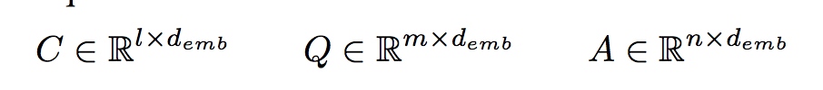
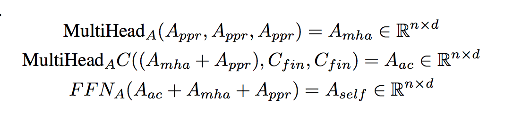

# The Natural Language Decathlon: Multitask Learning as Question Answering

multitask question answering network (MQAN)

--

##### reference:  
> coattention of [Xiong et al., 2017] 
> 
> pointer-mechanism of
[See et al., 2017] i

---
## Model

#### variables

> each example consists of a *context*, *question*, and *answer*.
>> **context**: l tokens
>> 
>> **question**: m tokens
>> 
>> **answer**: n tokens
>> 
>> corpus: d_emb

--

#### encoder
> input: 3 matrices: context, question, answer
>
> deep stack of recurrent, coattentive, and self-attentive layers
> 
>> product final representations: **context** and **questions** (capturing local and global interdependencies)

--

#### Decoder(Answer representations)

> projecting the answer embeddings onto a d-dimensional space
> 
> with position encodings

**Multi-head Decoder Attention**

reference: self-attention2[Vaswani et al., 2017]

> residual feedforward network applied after MultiHead attention over the context.

**Intermedia Decoder state**