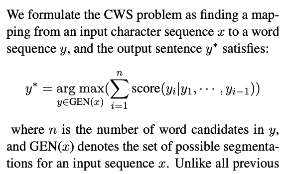
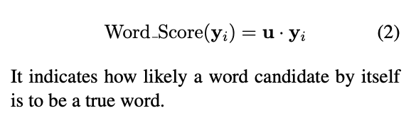
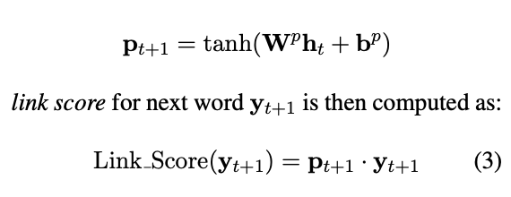
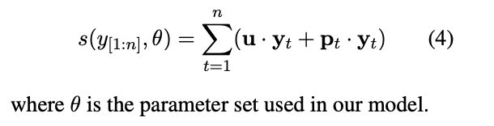
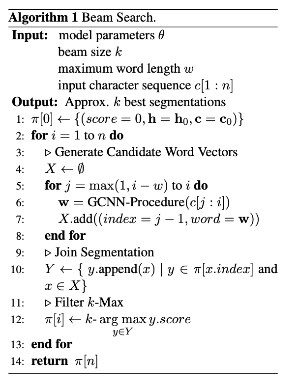

# Neural Word Segmentation Learning for Chinese

[paper](https://arxiv.org/pdf/1606.04300v2.pdf)

---


Instead of make tagging decision on individual characters, we directly <mark>evaluates the relative likelihood of different segmented sentences and then search(beam search) for a segmentation with the highest score(scoring model covers 3 levels: character, word, sentence) </mark>.

+ In this paper, we propose a novel neural framework which thoroughly
**eliminates context windows and can utilize complete segmentation history**.  

---

+ 1. gated combination neural network over characters to produce distributed representations of word candidates.
+ 2. feed into LSTM, the scoring model.

---
### Task Definition

  
找到一组词的切割，使得累积的score值最大

---

+ 1, char embedding
+ 2, 

---

## word score
  


```
包含reset gate 和 update gate

reset gate: 候选词中每个字符相互相关，依据相关系数矩阵，产出attention，后续作用于字符本身，计算出w_hat

update gate: w_hat与候选词中每个字符，via系数矩阵，产出attention(sum=1)
```
理解：词表达由各个char的vector的信息叠加（加权，权值可理解为attention）和 **与** 所有char vectors的混合信息（非线性加权和，权值可理解为attention） 共同表达（相加）。

+ **r** reset gate,  *dep:* **R × c**
+ **z** upate gate,  *dep:* **U × [w,c]**


--

--


--


--
word score  
  
u is trainable parameter

---  
## link score  
capture the coherence in a segmented sentence.

h_t 是LSTM的hidden state, Wp、bp是trainable parameter，y_t+1是word vector

 

## sentence score

 

## beam serch  
dynamic programming.  
The main idea is that any segmentation of the first i characters can be separated as two parts, the first part consists of characters with indexes from 0 to j that is denoted as y, the rest part is the word composed by c[j+1 : i]   
 

## loss function

```count the number of incorrectly segmented characters and then multiple it with a fixed discount parameter for smoothing```

Hinge Loss