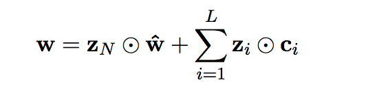

# Neural Word Segmentation Learning for Chinese

[paper](https://arxiv.org/pdf/1606.04300v2.pdf)

---

## word score


```
包含reset gate 和 update gate

reset gate: 候选词中每个字符相互相关，依据相关系数矩阵，产出attention，后续作用于字符本身，计算出w_hat

update gate: w_hat与候选词中每个字符，via系数矩阵，产出attention(sum=1)

```
+ **r** reset gate,  *dep:* **R × c**
+ **z** upate gate,  *dep:* **U × [w,c]**


--

--


--


## link score

## sentence score

## loss function
