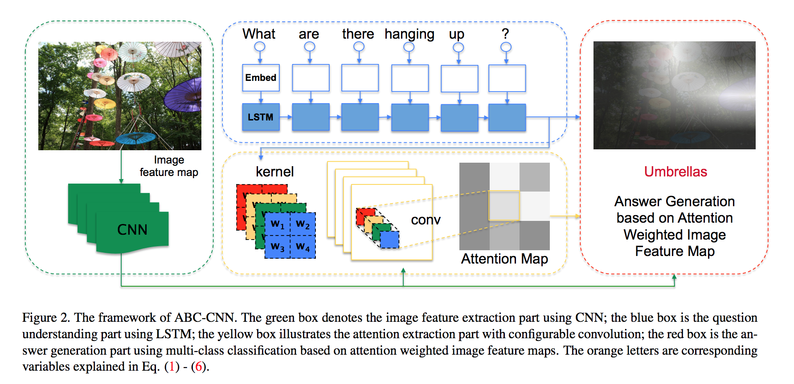
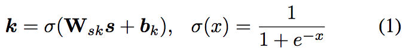
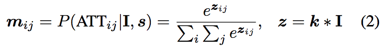

# ABC-CNN: An Attention Based Convolutional Neural Network for Visual Question Answering

answers a questionusing a multi-class classifier based on the **image feature map I**, the **attention weighted image feature map**, and the **dense question embedding vector s**. 

--

### Definition
+ image feature map: **I**
	+ convolution on the input image, output: **I**
+ semantic dense embedding: **s**
	+ LSTM(words)
+ configurable convolution kernel(CCK): **k** 
	+ 
	+ nonlinear projection from semantic representation to CCK
+ question-guided attention maps(QAM): **m**
	+ 
	+ convolve k and I, and then normalize
	+ convolution  is padded so that the QAM m has the same size as the image feature map I

--
### fundamental optimization

1. To **avoid overfitting**, we apply an 1×1 convolution on the attention weighted feature map to reduce the number of channels, resulting in a reduced feature map Ir. 

2. g(.) is the element-wise scaled hyperbolic tangent function: g(x) =1.7159 · tanh( 23x) [【13】](Efficient backprop In Neural networks: Tricks of the trade).  This function leads the gradients into the most non-linear range of value and enables a higher training speed.
