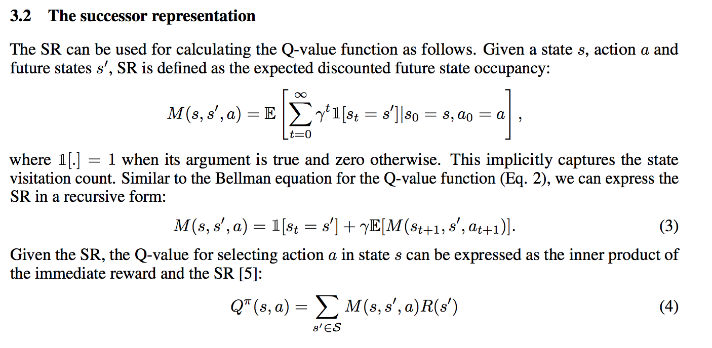
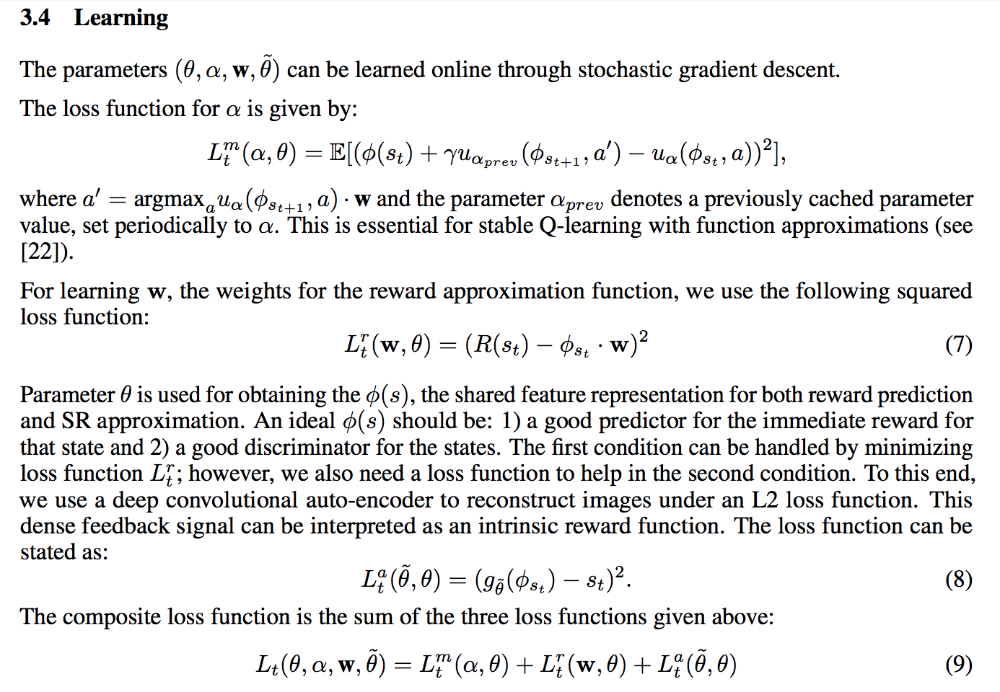

Successor Representations(SR)

representing value function.
it decomposes the value function into two components -- a reward predictor and a successor map.

appealing properties:
```
	combines computational efficiency comparable to model-free algorithms with soe of the flexibility of model-based algorithms.
```

```
successor map: represents the expected future state occupancy from any give state.
reward predictor: maps states to scalar rewards
```



