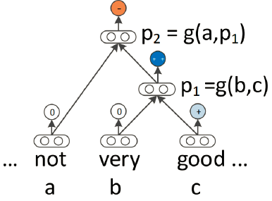

# Recursive Neural Network

coupled with LSTM units to deal with problems such as gradient vanishing

--

**Vanilla Recursive NN**  
*a compositional function (i.e., network) combines constituents in a bottom-up approach to compute the representation of higher-level phrases*  
Bottom-UP, word-phrase representation

--

**MV-RNN**

*words are represented by both a matrix and a vector, meaning that the parameters learned by the network represent the matrices of each constituent (word or phrase).*

--

**Recursive Neural Tensor Network(RNTN)**  
*enables more interaction between input vectors to avoid large parameters as is the case for MV-RNN*  
