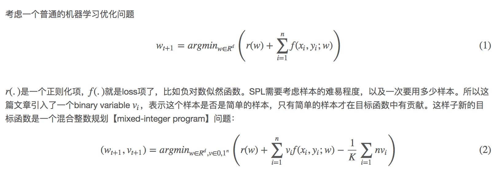
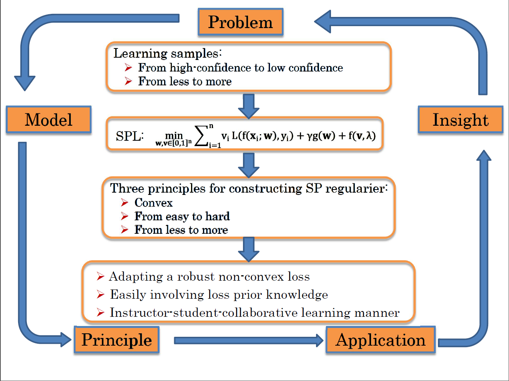

# Self Paced learning

### 基础

[link](https://jiqiujia.github.io/2016/09/02/Self-Paced-Learning-for-Latent-Variable-Models-NIPS10/)

[paper](files/3923-self-paced-learning-for-latent-variable-models.pdf)

SPL，固名思义，就是一步步，有自主步伐节奏得学。Motivation应该来自于09年Bengio提出的Curriculum Learning(CL)。CL受到认知科学的启发——人在学东西的时候也没办法一下子接受特别困难的知识，是从简单的开始学起。所以CL是根据某种先验，将按照困难度排好序的样本逐渐喂给模型。SPL与CL最大的不同之处在于这个排样本的先验是嵌入到模型里面的，是动态的，可以优化学习的。
这样子从易到难得学可以看成是一种正则化的手段，有助于加快收敛，并达到一个更好的local minimum.

K 是用来调整要选多少简单的样本：当K比较大时，为了使目标函数更小，那么就只有f(.)比较小【high likelihood，因为是负的】的样本会被选中。
更重要的是，每个样本是否是简单的其实不是单独考虑的——它们之间通过参数w联系起来，也即，一组样本是简单的条件是有w能够拟合这组样本，得到一个值比较小的f(.)。
在训练过程中，我们逐渐减小K的值，使得越来越多的样本能够被考虑进来。当K趋近于0时，优化(2)其实就相当于在优化(1)。
然而(2)这样的混合整数规划问题通常不好求解，所以我们松弛对参数v的约束：允许vi的值落在[0, 1]之间。这个松弛是紧的【tight】，也就是说，取得最优值的w，对应的每个vi一定是0或1。这很好理解：如果f(xi,yi;w)<1/K，那么肯定vi=1能取得最小值；如果f(xi,yi;w)>1/K，那么肯定vi=0能取得最小值。
经过这样的松弛之后，问题就比较好解了。特殊情况下，如果r(.)和f(.)都是凸的，那么这个目标函数就是个biconvex的目标函数，可以采用诸如坐标下降的方法求解。作者用的是alternative convex search(ACS)。一般情况下，如果r(.)和f(.)都是非凸的，也可以用类似的方法求解：给定w，最优的v值为vi=δ(f(xi,yi;w)<1/K，其中δ(.)为指示函数【indicator function】；给定v，优化(2)就跟优化(1)一样。

