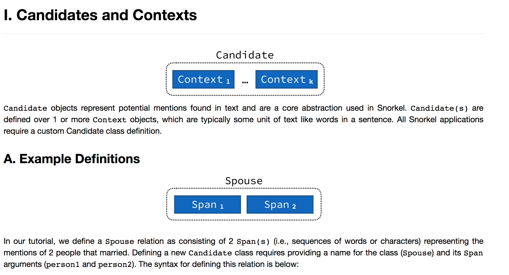

# Snokel Notebook

---

### Structure


---

### SnorkelSession
> 和database链接的功能

---

### DocPreprocessor
> 文本预处理。
>
> **TSVDocPreprocessor**

---

### CorpusParser
> document -> sentences -> tokens -> NER
> 
> Spacy OR jieba

---

### Generat Candidates
> 抽取candidates (是一个object)

#### Define Candidate Schema
> subclass of **Candidate**

#### CandidateExtractor
> **ContextSpace**,  
> define "space" of all candidates we consider.
> *A ContextSpace defines the "space" of all candidates we even potentially consider; in this case we use the Ngrams subclass, and look for all n-grams up to 3 words long*
> 
>		比如 **Ngrams** subclass
>
>  
> **Matcher** 过滤candidates. 
> *A Matcher heuristically filters the candidates we use. In this case, we just use a pre-defined matcher which looks for all n-grams tagged by CoreNLP as "PERSON"*
>
>
> 
> **CandidateExtractor**, 
> *A CandidateExtractor combines this all together!*
> 
> 		UDF， 提取labeling用的candidates


```python
对于
CandidateExtractor (candidate_class, candidate_spaces, matchers, 各种relation)

> 	CandidateExtractorUDF.apply(
	> 先space提取、然后matcher计算	
	> self.matchers[i].apply(self.candidate_spaces[i].apply(context))
		> self.candidate_spaces[i].apply(context) => yield TemporarySpan()
		> self.matchers[i].apply(  TemporarySpan() )
	
```
---

### Creating and Modeling a Noisy Training Set

#### Labeling Functions
> 
> Pattern-based LFs
> 	commono sense text paterns
> 
> Distant Supervision LFs
> 	load a list of known candidates and 
> 	check to see if the candidate pair matches 
> 	one of these
> 
> 	Developing Labeling Functions

#### Applying Labeling Functions
> **LabelAnnotator** class, 生成 Labels 和 LabelKeys
> 
> Note that this will delete any existing Labels and LabelKeys for this candidate set

#### Fitting the Generative Model