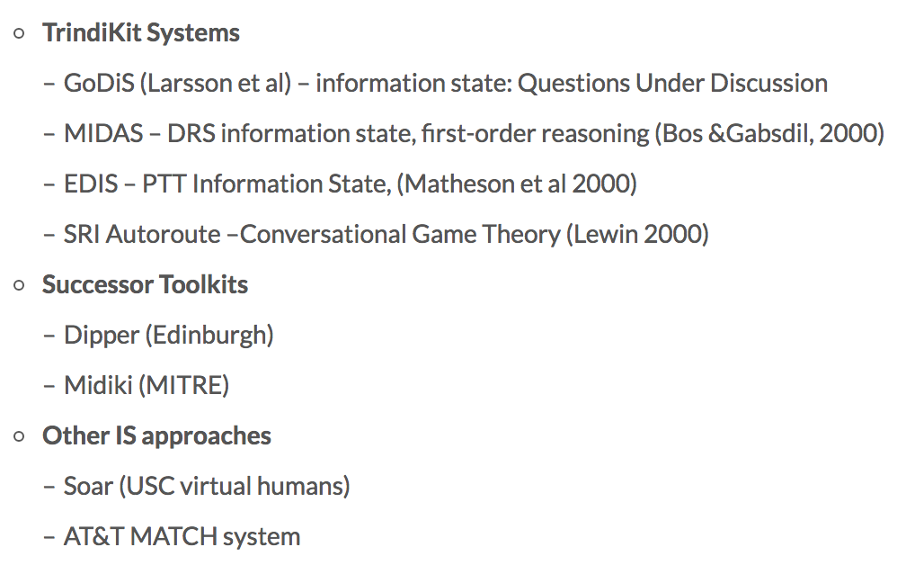

# Chatbot Structure

--
## Flow
Query -> NLU -> DM -> NLG

--

理论与实践存在很大的差别：

+ 理论模型：logic-based, BDI, plan-based, attention/intention
+ 实践模型：finite-state 或者 frame-based

--

## DM

**DM设计理念**

+ **完整性**，具备建模各种类型对话的能力（不仅仅是slot filling）
+ **独立性**，当设计（变更）一个场景时，不需要考虑当前场景跳转到其他场景的情况
+ **模块化**，一些常用的业务组件(如：确认，slot filling，翻页等)，能呈模块化复用(同时允许业务自定义内部的多种属性)
+ **dialogs**
	+ 可复用
	+ 基础粒度的操作
	+ 可被其他dialog调用
	+ 可以是全局的 (global dialog)
		+ 在 recognizer 能够匹配时 trigger
		+ 可以提供一些 conversation support，像是 help/cancel 这些全局功能
		+ 应对各种话题切换（Tangents）
	+ root dialog
		+ 有且仅有一个
		+ dialog stack 里没有其他的 dialog 剩余时，则被唤醒
		+ 当前时刻 recognizer 并不能 trigger 其他的 dialog时，被唤醒
	+ dialog stack
		+ 存放目前已经被激活但还没完成的 dialog。dialog 一旦完成就会被 pop 出去。

--

**挑战**

+ 模型描述能力与模型复杂度的权衡
+ 用户对话偏离业务设计的路径
	+ 系统问用户导航目的地的时候，用户反问了一句其他问题
+ 多轮对话的容错性
	+ NLU解析出现偏差时
+ 多场景的切换和恢复 <mark>☆</mark>
	+ 场景的切换与恢复
+ 降低交互变更难度，适应业务迅速变化
+ 跨场景信息继承

--
**常用模型类型**

[refer](http://www.shuang0420.com/2018/01/03/NLP%E7%AC%94%E8%AE%B0%20-%20%E5%A4%9A%E8%BD%AE%E5%AF%B9%E8%AF%9D%E4%B9%8B%E5%AF%B9%E8%AF%9D%E7%AE%A1%E7%90%86(Dialog%20Management)/)

|DM  |  | | |
|:------------- |:---------------:| -------------:|:---------------:|
| Agent      | **DST_l1** | *DST_l2*|         **DT** |
| |Structure-based  | |
| |  |*AIML* (key phrase reactive approache)| |
| | |*Tree and FSM based* (树&有限状态机)| |
| | Principle-based|| | 
| | | *Frame-based*| |
| | | *Agenda+Frame(CMU communicator)*| |
| |Information-state | | |
| | Plan-based| | | |
| | Statistical| | | |
| | | *RL-Based*| | |
| | | *AI+HI*| | |

---
#### AIML
AIML （人工智能标记语言），XML 格式，支持 ELIZA 的规则，并且更加灵活，能支持一定的上下文实现简单的多轮对话（利用 that），支持变量，支持按 topic 组织规则等。

--
#### Trees and FSM

> 人工定义（穷举）
> 
> 系统问、用户答（答非所问的被忽略）
> 
> 灵活性差，表达能力有限

> 实际中，通常会加入其它机制（如变量等）来扩展 FSM 的表达能力。

--

#### Frame based ([填槽与多轮对话](https://www.pmcaff.com/article/index/971158746030208?from=related&pmc_param%5Bentry_id%5D=950709304427648))
> *frame*: 槽位（Slot）
> 
> slot filling过程，可用于拓展FSM方法
> 
> 支持混合主导型系统（相对灵活）
> 
> 缺少层次结构

**填槽**

+ 实体抽取 **[wit](https://wit.ai/docs/recipes)**
	+ 有限关键词实体抽取(词典)
	+ 非有限关键词实体抽取（搜索策略为 free-text + keywords）
	+ 子串实体抽取 （子句）
+ 抽取策略
	+ trait （整句为输入，用于意图检测、情感分析）
	+ free-text（抽取子串，即子句）
	+ keywords（字典）

--

#### Agenda+Frame ([paper](http://www.cs.cmu.edu/~xw/asru99-agenda.pdf))
> Frame的基础上增加了层次结构
> 
> 支持话题切换、回退、退出
> 
>		product： 	产品树，反应完成这个任务需要的所有信息的顺序
>		process： 
>			agenda（任务计划，类似栈结构，话题的有序列表，handler的有序列表）
>			handler（产品树上每一个节点对应一个handler，一个handler封装一个information item）

**topic-specific form**
> constraint slots (typically corresponding to elements of a query)
> 
> solution slot (containing the result of an executed query).

--

#### Information-state
对话建模的形式化理论。识别对话中流转信息的 relevant aspects，以及这些成分是怎么被更新的，更新过程又是怎么被控制的
> **Statics**
> 
> 	● Informational component, 包括上下文、内部驱动因子（internal motivating factors）. e.g., QUD, common ground, beliefs, intentions, dialogue history, user models, etc.
> 
> 	● Formal representations, informational components 的表示. e.g., lists, records, DRSs,…
> 
> **Dynamics**
> 
> 	● dialog moves, 会触发更新 information state 的行为的集合. e.g., speech acts
> 
> 	● update rules, 更新 information state 的规则集合. e.g., selection rules
> 
> 	● update strategy, 更新规则的选择策略，选择在给定时刻选用哪一条 update rules

基于information-state实现的系统

--

#### Plan-based [paper](http://citeseerx.ist.psu.edu/viewdoc/download?doi=10.1.1.65.8451&rep=rep1&type=pdf)
多指BDI(Belief, Desire, Intention)模型
> 信念(Belief), 基于谓词KNOW，如果A相信P为真，则用B(A,P)来表示
> 
> 期望(Desire), 基于谓词WANT，如果 S 希望 P 为真（S 想要实现 P），那么用 WANT(S, P) 来表示，P 可以是一些行为的状态或者实现，W(S, ACT(H)) 表示 S 想让 H 来做 ACT

--

#### RL-Based
利用simulated user来模拟实际交互，根据reward优化

#### AI+HI
此处HI表示Human Intelligence，即真人智能。AI+HI表示机器助理和真人助理结合起来，为用户提供优质的体验。为什么要这么做呢？因为当真人能够和机器配合时，能产生一个正反馈：真人纠正机器的错误 -> 更好的用户体验 -> 更多的活跃用户 -> 获取更高质量的数据 -> 训练更好地模型 -> 机器更好地辅助真人。

HI和AI如何无缝的配合呢？我们通过群聊将用户、AI和HI放在一个群里。由AI根据置信度来判断，什么情况下需要将HI加入群内，将什么样的HI加入群内，以及什么时候HI来干预。AI和HI的配合分为三种：1）AI置信度较高时，无需HI干预，对话系统完全由AI来执行动作；2）AI置信度不高时，AI生成候选动作辅助HI来动作；3）AI不确定性很高时，完全由HI接管来执行动作。

在基于AI+HI的对话系统中，HI扮演三种角色：1）为AI提供反馈，如NLU出现错误时，HI可以纠正，然后AI在纠正后的对话状态下继续工作；2）在AI的辅助下执行动作，比如AI生成候选动作但不执行，由HI进行判断最终来执行；3）产生标注数据使AI不断进化，例如HI每一次纠错、执行动作都是一个标注的样本，可以用于训练AI。