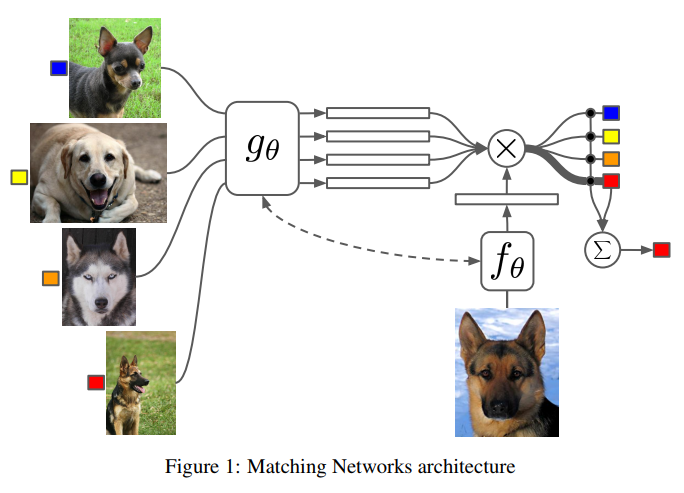
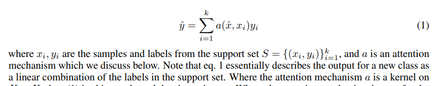

# Matching Networks for One Shot Learning

Matching Net, which utilize attention and memory that enable rapid learning.

Machine Learning principle: test and train conditions must match.

Combine non-parametric and parametric approach.

Cast the problem of one-shot learning within the set-to-set framework.

matching network produce sensible test labels for unobserved classes without any changes to the network.

**Figure1. Matching Networks architecture**


  
the output for a new class is a linear combination of the labels in the support set.

the estimation for y_hat label is Akin to kernel density estimator.


使用可称为attention的函数计算新输入x_hat与memory中的sample的距离，实现对sample所对应的label进行加权处理。 
实现上，label数据是one-hot labeling，因此它无法做到在种类增加的情况下来one-shot learning。另外training的细节依然较为模糊

[reference_blog](https://blog.acolyer.org/2017/01/03/matching-networks-for-one-shot-learning/)


---
## matching network code
[referred github](https://github.com/AntreasAntoniou/MatchingNetworks)

### 看了代码之后的理解
代码看下来，并没有producing new class 的功能。 
**训练阶段：**

+ 构建 suppot set: n\_class\_per\_supportset * n\_sample\_per\_class, (基础实验中为 5*5)
+ 模型将supportset样本数据与target_sample均embedding后，做distance calculation（此处为cosine similarity）
+ similarity 作为weights 对support set的label进行加权，计算得到target_sample的label结果。

**疑问**

模型是否具有domain transfer的能力？ 也即训练好的模型，放到一个新的样本集里，给supportset之后能否较好的实现one-shot learning

**自我答疑**

训练的数据中class可以任意组合，训练的模型需要在embedding层面达到一个较好的表达能力，从而实现在给定support类目的情况下，能够根据embedding结果进行自我分类 （类目仅限定在support set中）

### dataset method:
+ The N-way Omniglot task setup is as follows: pick N unseen character classes, independent of alphabet, as L. 
+ Provide the model with one drawing of each of the N characters 

---

### samples\_per\_iter
```

```

---

### 数据生成：
直接按照数据集生成的数据，sample set 与 support set 在experiment 代码里面