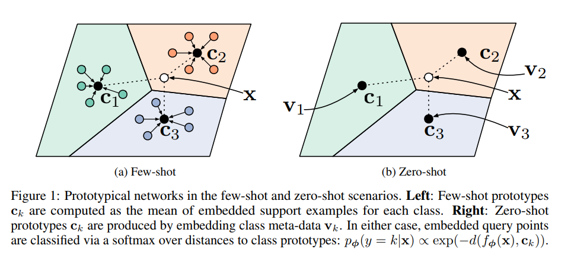
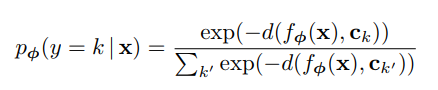
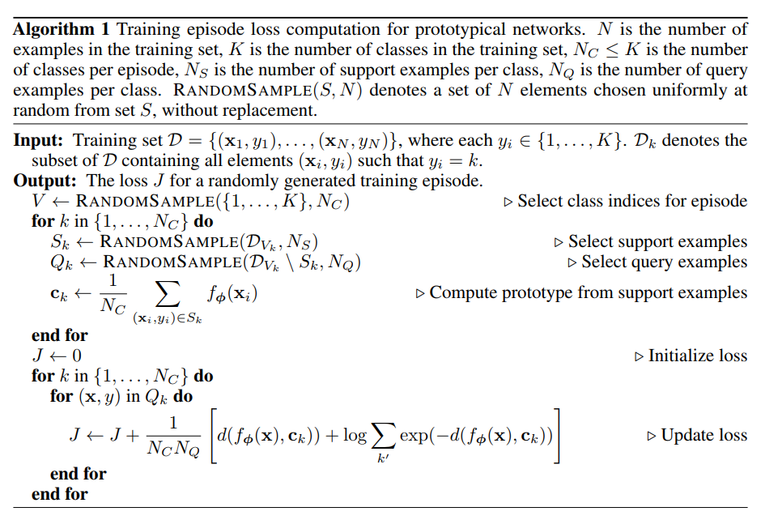
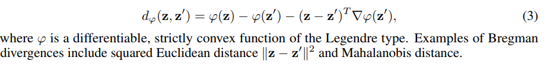

# Prototypical Network

it **learns a metric space** in which classificatoin can be performed by computing distances to prototype representations of each class. 

**Bregman divergence** as distance measurement

empirically found: the choice of distance is vital, as <mark>Euclidean distance greatly outperforms the more commonly used cosine similarity</mark>. (hypothesize: because all of **the required non-linearity can be learned within the embedding function**)

## Model

each prototype is the **mean vector** of the embedded support points belong to its class. 

--

the **predicted distribution** is represented by softmax over distance to the prototypes in the embedding space:   

--

**algorithm pesudo code**

## Connection with Mixture Density Estimation

prototype netoworks with distance functions known as *regular Bregman divergences* is equivalent to mixture density estimation on the support set with an exponential family density. 

regular Bregman divergence: 

## Comparison to Matching Networks
Matching Networks produce a weighted nearest neighbor classifier given the support set.  
While prototypical networks produce a linear classifier when squared Euclidean distance is used.

In one-shot learning, prototypical networks are equivalent to matching networks

## Tricks

1. distance metric function choice: squared Euclidean distance is good. The cosine similarity is not a Bregman divergence and cannot be proved be quivalence to mixture density estimation.
2. N_class for train can be greater than test phase. While keeping N_support_per_class same between train and test phase.