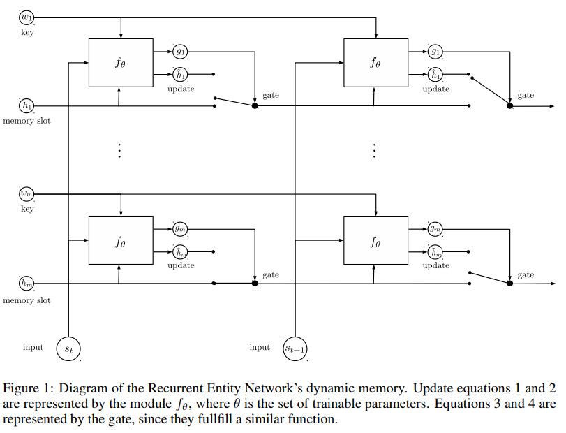

# Entity Network

[refered github](https://github.com/jimfleming/recurrent-entity-networks)

--

memory的结构固定，通过定制的 DynamicMemoryCell进行recurrent计算，更新每个memory block的状态



整体代码结构清晰，

memory state的初始化是依靠词向量的头n个词的向量(保证memory初始时刻存储ngram的story信息咯？):

```
keys = [key for key in range(vocab_size - num_blocks, vocab_size)]
keys = tf.nn.embedding_lookup(embedding_params_masked, keys)
keys = tf.split(keys, num_blocks, axis=0)
keys = [tf.squeeze(key, axis=0) for key in keys]
```


其中attention的计算执行了

```
# Subtract max for numerical stability (softmax is shift invariant)
```

memory state 的取模计算方式为：

```
state_j_next_norm = tf.where(
tf.greater(state_j_next_norm, 0.0),
state_j_next_norm,
tf.ones_like(state_j_next_norm))
state_j_next = state_j_next / state_j_next_norm
```