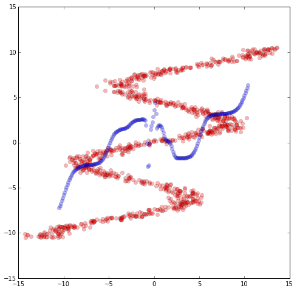
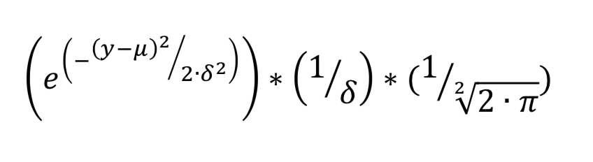

# Mixture Density Network

normal DNN cannot handle the Mapping which is one-to-multiple function. (because the DNN's prediction represent the mean of the predicted distribution)：

To solve this, the key is to [**model different potential states and context in the data and be able tot generate entire probability distribution for the output（for dynamic phenomenon, it means a plausible distribution of the next point conditional to the entire historical set of points）.**](http://blog.otoro.net/2015/12/12/handwriting-generation-demo-in-tensorflow/)  Once we have a good network to generate accurate distributions of the future given the historical past, we can just sample from the probability distribution to generate our handwriting sample（**那是否这个sampling的过程由统一的network来实现？**）. 

### Loss Function
minimize the **logarithm of the likelihood of the distribution vs the training data**.

--

reference：

[refer1](http://blog.otoro.net/2015/11/24/mixture-density-networks-with-tensorflow/) (注意：Note that in the actual softmax code, the largest value will divide both numerator and denominator to avoid exp operator easily blowing up. In TensorFlow, the network is described below:)

[refer2_follow refer1](http://blog.otoro.net/2015/12/12/handwriting-generation-demo-in-tensorflow/)