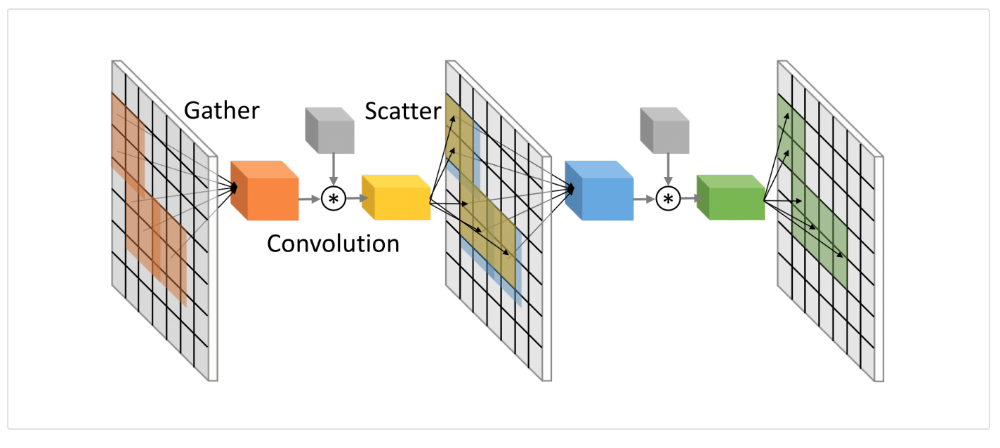

### SBNet

##### CNN computation efficiency optimizer

by Uber

Leveraging Activation Block Sparsity for Speeding up Convolutional Neural Networks



```
we define block sparsity from a mask representing the locations where the activations are non-zero. 
This mask can come from a priori knowledge of the problem, or simply from thresholding averaged activations. 
In order to exploit highly optimized dense convolutional operators, 
we define two operations that transform the sparse activations into a smaller feature map containing only non-zero elements.
```

link:

1. [github](https://github.com/uber/sbnet)

2. [blog](https://eng.uber.com/sbnet/)