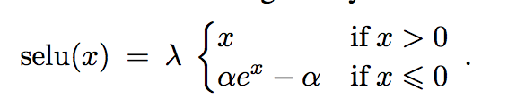

# Self-Normalizing Neural Networks

---

**“scaled exponential linear units” (<mark>SELUs</mark>)**

+ activations close to zero mean and unit variance that are propagated through many
network layers will converge towards zero mean and unit variance
+ prove an upper and lower bound on the variance,
thus, vanishing and exploding gradients are impossible (not close to unit variance)

---
### Comparable Method
+ ReLU networks without normalization
+ batch normalization
+ layer normalization
+ weight normalization
+ highway networks
+ residual networks

---
### Model
--
**SELU**  

--
**alpha dropout**  
“Alpha-dropout” fits well to scaled exponential linear
units by randomly setting activations to the negative saturation value  
+ dropout rates 1 − q = 0.0t or 0.1
